#  Sistemas Operativos Linux, sus Componentes y su Aplicación en la Vida Cotidiana

- Integrantes:
    - Brandon Sánchez Porras. bsanchez20389@ufide.ac.cr
    - Jason Solís Mata. jsolis80423@ufide.ac.cr
    - Isaac Hidalgo Vargas. ihidalgo80219@ufide.ac.cr
    - Sebastián Valverde Hernández. email@example.com

--- 
<!-- paginate: true -->
<!-- footer: "_Universidad Fidélitas_ | _Introducción a la Informática: SC-103_ | Grupo 4 | **Sistemas Operativos Basados en Linux** > Introducción" -->

# Introducción <!-- fit -->

--- 

# Resumen

- Explorar la historia de los sistemas operativos basados en Linux
- Explicar el funcionamiento interno de los sistemas operativos _**basados** en Linux_
- Exponer su aplicacion en la Vida cotidiana
- Explicar la instalación de un SO basado en Linux

---

# ¿Cómo nacieron los sistemas operativos basados en Linux? <!-- fit -->

---
<!-- header: "**Unix**"-->
## 1969

- El sistema operativo UNIX inició su desarrollo a manos de Bell Labs de AT&T en los estados Unidos
- AT&T no tenía permitido involucrarse en actividades comerciales fuera de su servicio de telefonía
- UNIX era distribuido con código fuente a las Universidades con una licencia académica que permitía el estudio, modificación y redistribución del código

---

## 1984

- AT&T se deshizo de sus compañías de operación regional
- AT&T se libera de su obligación de no entrar en el negocio de las computadoras.
- UNIX se convierte en _software_ **propietario**, y AT&T lo comercializa

---

- Debido al cambio en la licencia de _UNIX_, se crean 3 proectos importantes:
    - The GNU Proyect
    - The GNU General Public License (GNU GPL)
    - MINIX
    
---

<!-- header: ""-->

# The GNU Proyect

- **GNU** es un acrónimo recursivo: **G**nu ~~is~~ **N**ot **U**nix
- Creado en 1983 por **Richard Stallman**
- Tenía como proposito tener todas las utilidades para escribir y ejecutar programas en C
- Su kernel, GNU Hurd, no fue muy exitoso
- Buscaba compatibilidad con programas para UNIX

---


# MINIX

- Sistema operativo _UNIX-Like_ o inspirado en UNIX
- Creado por **Andrew S. Tanenbaum** y lanzado en **1987**
- Dirigido a estudiantes con interés en sistemas operativos

---

<!--header: "**Linux**"-->

## Otoño, 1990
- **Linus Torvalds**, estudiante de la Universidad de Helsinki, Finlandia, tomó un curso de UNIX
- El _hardware_ de su Universidad no soportaba más de 16 usuarios a la vez
- Linus compró su primera computadora personal y le instaló **MINIX**

---

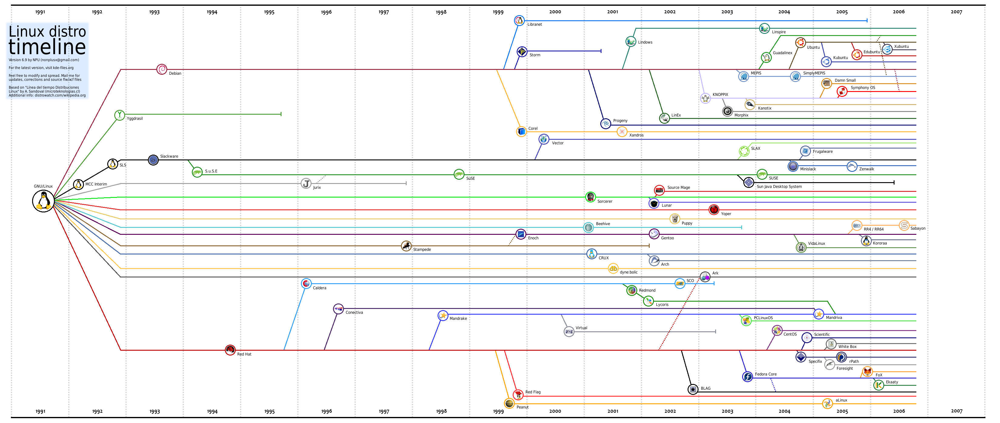

## 1991
- Debido a que la licencia para fines educativos de MINIX , Linus decidió crear Linux, el cual fue lanzado este mismo año

## Actualidad
- Se crean distribuciones basadas en el _kernel_ Linux, como por ejemplo Ubuntu, Debian, Arch Linux, etc.

--- 
<!-- header: "" -->
# ¿Por qué? <!-- fit -->

---

# Bajo Porcentaje de Usuarios
- De acuerdo con StatCounter, para Enero de 2023, solo un 1.5% de dispositivos en el mundo se rigen por un sistema operativo basado en Linux.
- El sistema operativo lider en el grafico a continuación, con un 43.01% de dispositivos, es Android, el cual está basado en Linux, sin embargo, pocos conocen o aprecian este dato.

---

<!-- _footer: ""-->

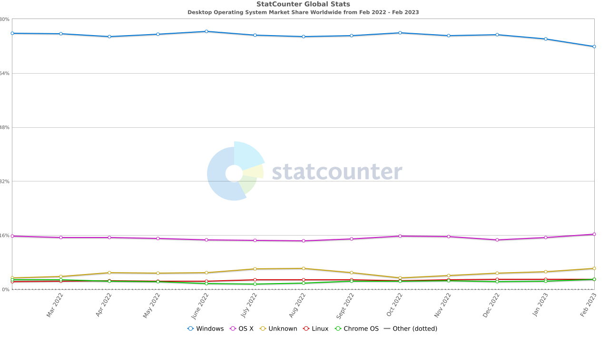

---

# ¿Cómo se lleva a cabo la educación al respecto?

- Se analizan estos datos para demostrar que pocas personas conocen al respecto
- Se demuestra los elementos que componen un sistema basado en Linux y sus ventajas por medio de una máquina virtual

---

# Aclarando algunos conceptos <!-- fit -->

---

# _Software_
- La parte lógica del ordenador
- Dos tipos son relevantes para nuestra investigación:
    - Software de sistema: Herramientas y utilidades de apoyo para el mantenimiento del equipo
    - Software de Programación: Conjunto de programas que permiten al desarrollador la creación de los mismos
    
---

# _Hardware_
- La parte física del ordenador, los circuitos, los transistores, los chips como el procesador, la tarjeta gráfica, etc.
- Cualquier componente de una computadora que se pueda tocar.

---

<!-- header: "**Componentes de un sistema operativo GNU+Linux**" -->

# _Kernel_
- Núcleo del sistema operativo
- Administra los dispositivos conectados al ordenador
- Actúa como intermediario entre los dispositivos y el _software_

---

# Gestor de Paquetes

- Descarga e instala software
- Descarga e instala las dependencias, manuales y archivos de configuración
- Administra el software, por lo que también permite instalar, desinstalar y modificar el software (actualizaciones)

---

# Sistema de Archivos

- Está almacenado en las particiones del disco dura
- Impone estructura en como se escriben archivos al disco duro
- Algunos sistemas de archivos populares son:
    - ```ext4```, por defecto en sistemas Linux
    - ```ntfs```, popular en sistemas windows
    - ```FAT```, popular en dispositivos portables
    - ```ZFS``` y ```BTRFS```, populares en servidores

--- 

# Core Utils

- Utilidades básicas de manipulación de archivos, texto y shell
- Las más populares en Linux proceden del **sistema operativo GNU** 
- Algunos ejemplos a continuación:
    - ```cp``` para cpiar archivos y carpetas.
    - ```ls``` lista el contenido de una carpeta
    - ```mkdir``` crea una carpeta
    - ```mv``` mover o renombrar archivos/carpetas
    - ```rm``` eliminar archivos o carpetas
    - ```touch``` crear archivos vacíos

---

# _Shell_

- La capa más externa del sistema operativo _(shell = caparazón)_
- Interfaz de linea de comandos con el sistema operativo
- Considera la primera palabra como un mandato y las posteriores argumentos

```bash
[usuario@máquina ~]$ mkdir ~/Escritorio/carpeta_de_prueba
[usuario@máquina ~]$ cd ~/Escritorio/carpeta_de_prueba
[usuario@máquina carpeta_de_prueba]$ touch archivo.txt
[usuario@máquina carpeta_de_prueba]$ ls
archivo.txt
[usuario@máquina carpeta_de_prueba]$ 
```

--- 
<!-- footer: "_Universidad Fidélitas_ | _Introducción a la Informática: SC-103_ | Grupo 4 | **Sistemas Operativos Basados en Linux** > Instalación" -->

<!-- header: ""-->

# Instalación de un sistema operativo minimalista basado en GNU+Linux paso a paso

---

# Paso #1: Obtención de la ISO

- Se obtiene el archivo ```.iso``` de la distribución a elegir, en este caso, **Arch Linux**

- Se navega a la página principal de la distribución, en este caso, https://archlinux.org

---
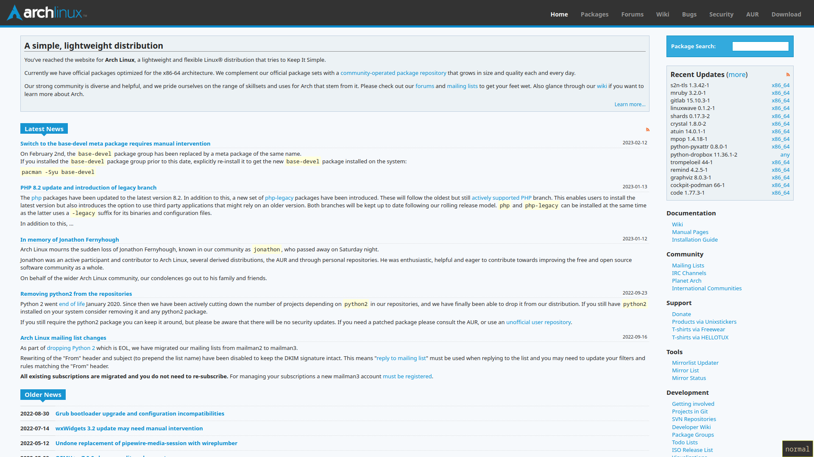

---

- Se hace click en el botón de **Descargar**
    

- Se selecciona la versión más reciente, en nuestro caso, ```2023.04.01```, normalmente es necesario tener un cliente Torrent para hacer la descarga, como BitTorrent o Transmission

--- 

# Paso #2: Grabar la ISO
- Requisitos:
    - Una USB (Llave Maya) de al menos 8GB de almacenamiento
    - Un programa para grabar o _flashear_ la ISO, como **Balena Etcher**, **Ventoy** o **Rufus**

---

# Balena Etcher

1. Seleccionar el archivo ```.iso```
2. Seleccionar el Dispositivo al que se grabará el archivo ```.iso```
3. Seleccionar el botón **Flash!** para proceder con la grabación

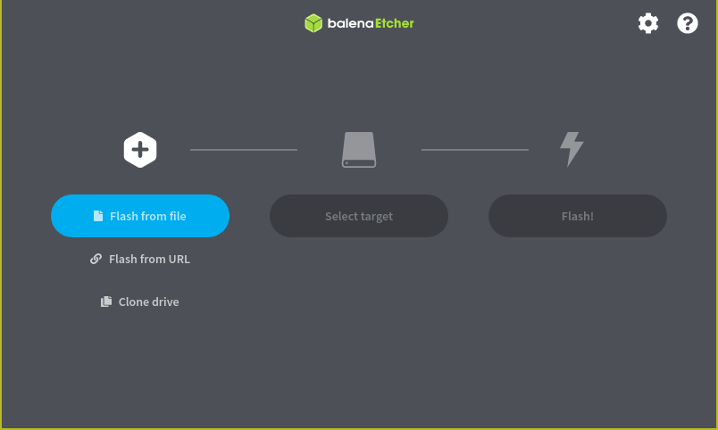
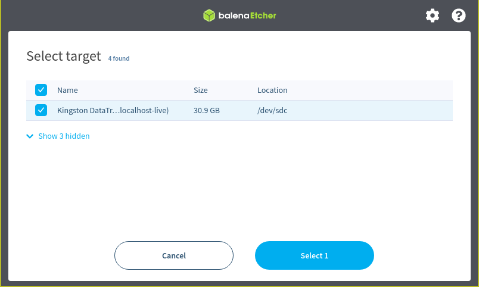
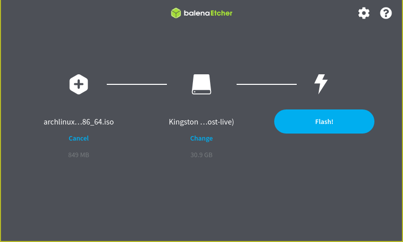

---


1. Encender la computadora.
2. Mientras esta enciende, presionar repetidamente las teclas ```F2```, ```F12``` o ```DEL```
3. En el menú que aparece, activar la opción de _USB Boot_.
4. Bootear:
    4.1 Menú de booteo: Seleccionar el menú de booteo y seleccionar la USB (llave maya)
    4.2 Orden de Booteo: Reordenar el booteo para que USB esté de primero y reiniciar.

---

# Lo primero que se muestra al usuario es lo siguiente

---

<!-- header: ""-->
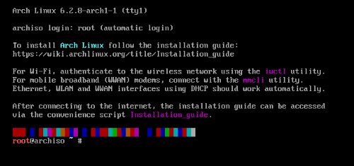

---

# Un poco intimidante, ¿Eh?

- No hay nada que temer, primero que todo, abramos el instalador:

```bash
root@archiso ~ $ archinstall
```

---

El instalador se ve así:

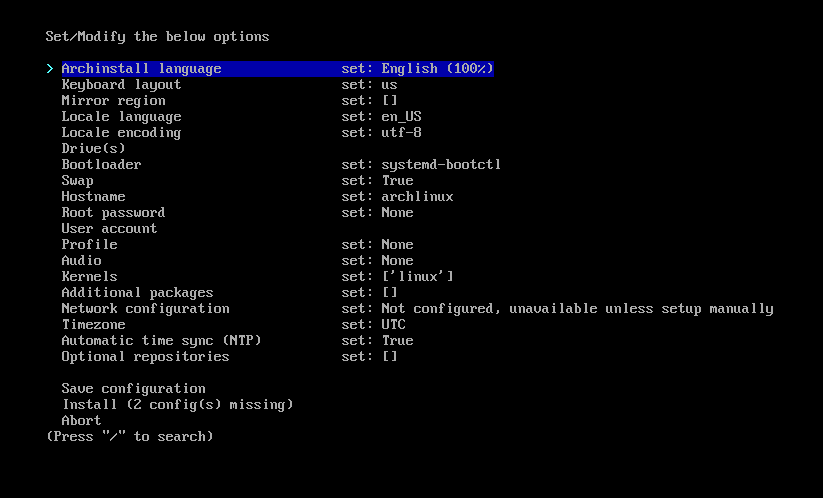

--- 

# Controles:
- Las flechas del teclado te mueven entre las opciones.
- La tecla ```Esc``` te permite saltar la sección actual y volver al menú principal
- La tecla ```/``` o ```Shift+7``` te permite buscar entre las opciones. 

---

# Instalando Arch Linux <!-- fit -->

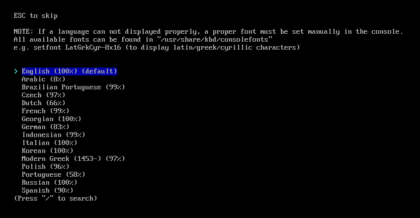

- Presiona la tecla Enter sobre la primera opción: _Archinstall Language_
- Presiona ```/``` o ```Shift+7``` para buscar
- Escribe "spa" y presiona ```Enter```

---
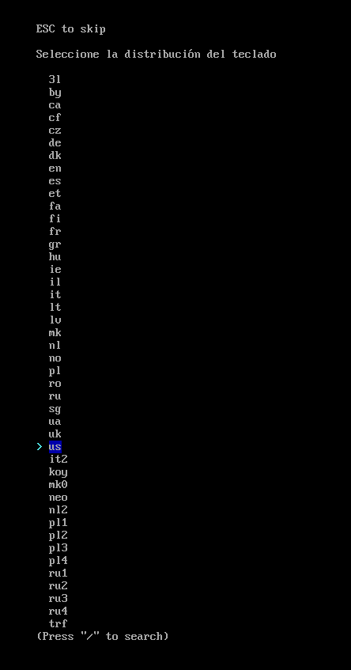

# Distribución de teclado
- Presiona la tecla Enter de nuevo
- Inglés: presiona Enter.
- Español latinoamericano: presiona ```/``` y escribe "la-latin1" y presiona Enter

---

# Región de Descarga


- Selecciona con ```TAB``` las regiones que considere más cercanas a tu ubicación, no olvides seleccionar _"Worldwide"_.
- Una vez seleccionadas las regiones de descarga, presiona ```Enter```

---

# Idioma Local

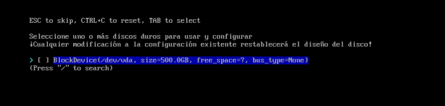

- Inglés: Presiona ```Enter```
- Español: Presiona ```/```, escribe "es_CR" y presiona ```Enter```

- Salta la opción de "Codificación Local", la configuración por defecto está bien.

--- 

# Discos
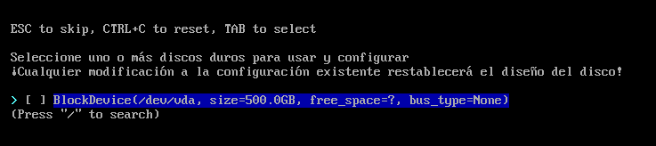

- Selecciona el disco en el que deseas instalar el sistema operativo con ```TAB``` 
- Presiona ```Enter``` una vez la selección esté lista

---

# Diseño del disco
1. Seleccionar la primera opción, "borrar todas las unidades seleccionadas"
2. Seleccionar el sistema de archivos ```ext4```
3. No crear una partición separada para ```/home```

---

# Encriptación del disco
- Dejar la contraseña en blanco

---

# Gestor de Arranque
- Salta esta sección

# Swap
- Salta esta sección

# Nombre del host
- Acá puedes definir un nombre para tu máquina

---

# Contraseña de Root

- Determina una contraseña fuerte, como por ejemplo: ```contraseña123*```😉. Esta contraseña es para el usuario _root_, el cuál tiene control completo sobre la máquina

--- 

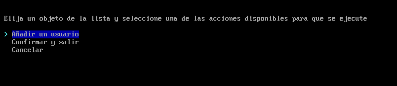

# Cuenta de Usuario
1. Selecciona "añadir un usuario", y presiona ```enter```
2. Escribe un nombre de usuario y presiona ```enter```
3. Escribe una contraseña para este usuario y presiona ```Enter```
4. Selecciona que tu usuario sí debe ser un superusuario
5. Selecciona "Confirmar y Salir"

---

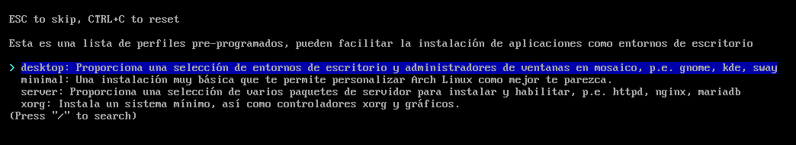
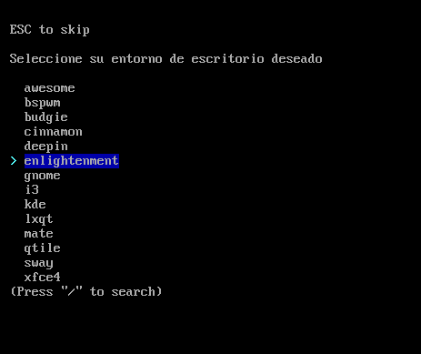

# Perfil

- Elige "Desktop" para tener un entorno gráfico.
    - Elige GNOME para un entorno moderno.
    - Elige Cinnamon para un entorno tradicional (estilo Windows)

---

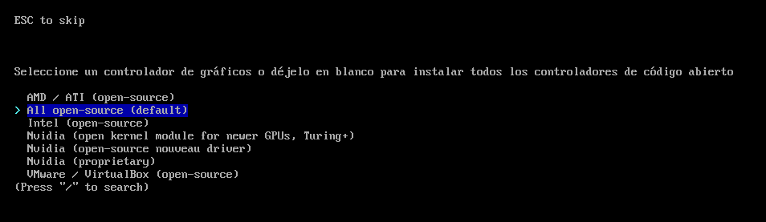

- Dependiendo de tu tarjeta de video, selecciona ```AMD / ATI``` Para AMD, ```Intel``` para Intel o ```NVIDIA``` para las tarjetas NVIDIA

--- 

# Audio
- Selecciona Pipewire

# Kernels
- Salta esta sección, linux ya está seleccionado.

# Paquetes Adicionales
- Salta esta sección

---

# Configuración de la Red
- Selecciona "Usar NetworkManager"

# Zona Horaria
- Presiona ```/``` y escribe "Costa_Rica" y presiona ```Enter```

# Sincronización automática de la hora
- Salta esta opción

--- 

# Repositorios adicionales
- Si planeas jugar, activa ```multilib```

# Presiona "Guardar Configuración"
- Selecciona "Guardar todo"
- Escribe "/root/"

# Presiona Instalar!

---

# Instalado

- Si se te solicita entrar a un chroot luego de la instalación, selecciona que no
- Escribe el comando ```reboot``` y presiona ```Enter```
- Durante del reinicio se puede desconectar el USB y empezar a utilizar el sistema!

---


<!-- footer: "_Universidad Fidélitas_ | _Introducción a la Informática: SC-103_ | Grupo 4 | **Sistemas Operativos Basados en Linux** > Conclusiones" -->

# Conclusiones <!-- fit -->

---

## ¿Por qué es importante conocer sobre Linux?
- Tener conocimiento sobre Linux puede ser de suma utilidad en entornos de servidores y desarrollo web
- Es una alternativa viable a los sistemas operativos _mainstream_ en algunos casos.

---

## La instalación de una de las distribuciones más complicadas de instalar, no es tan complicada

- Otras distribuciones como Mint, Fedora, y Ubuntu, son mucho más sencillas de instalar, pensadas para el usuario de escritorio.

---

# Linux es también un símbolo de libertad.

- Cuando utilizas un dispositivo con Linux, este es tu propiedad, al igual que el software que estas utilizando.
- Si Microsoft o Apple no se alinean con tus valores, puedes optar por Linux, como lo hizo Valve, con su SteamDeck.

---

# Capturas de Pantalla

---

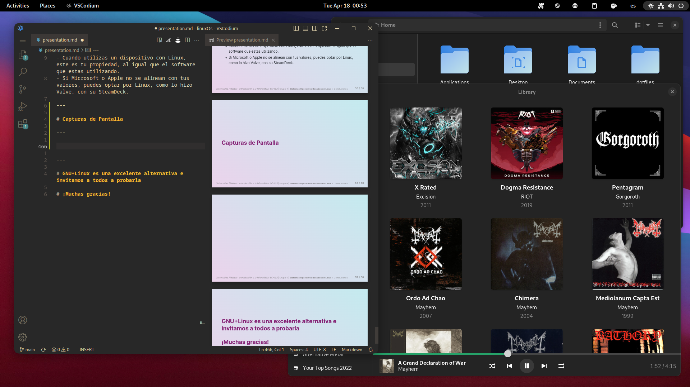

---

<video width="320" height="240" controls>
    <source src="media/demo.mp4" type="video/mp4">
    Your browser does not support the video tag.
</video>

---

# GNU+Linux es una excelente alternativa e invitamos a todos a probarla

# ¡Muchas gracias!